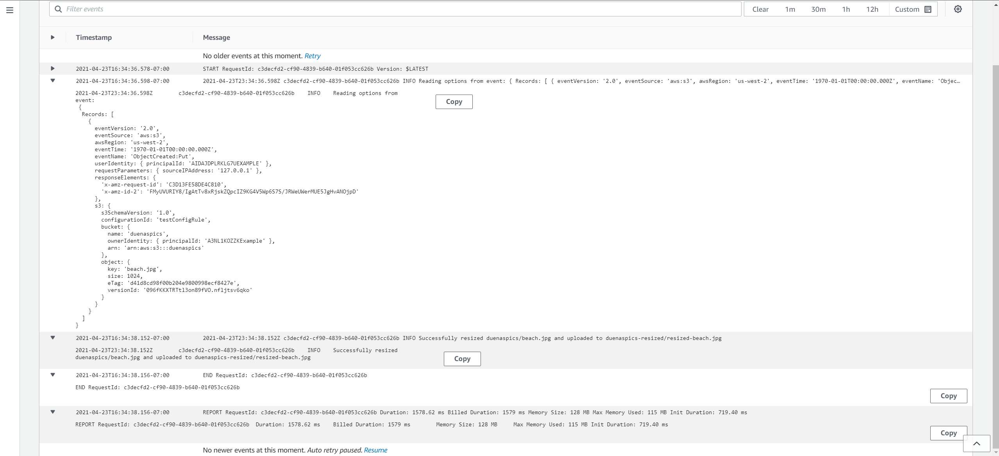
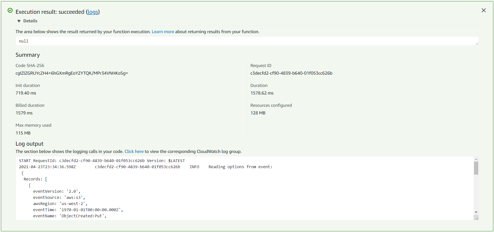

# S3 Lambda Functions

- Lambda function uploaded on AWS, attached to an S3 bucket as a trigger. When an image is uploaded to an S3 bucket the lambda function gets called and resizes the images and uploads to another S3 bucket.

## Issues during deployment

Main issue is trying to find a way to resize the image, and what connect my lambda to the other S3 bucket.

***Logs***

***Tests***
